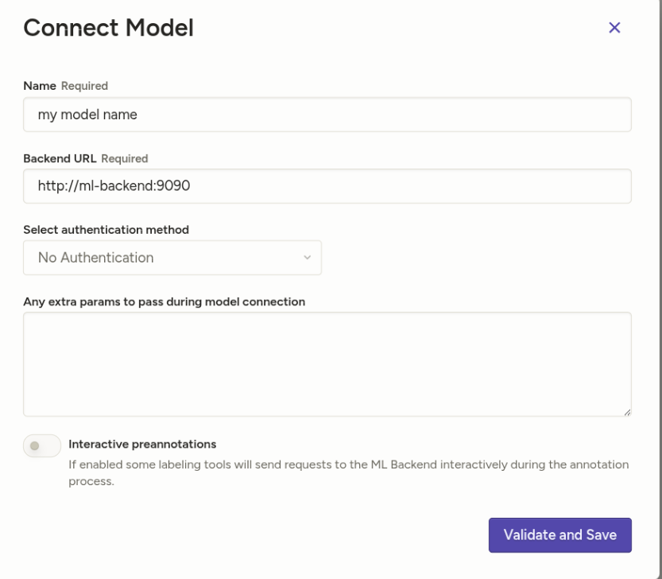

# YOLO Object Detection - prelabel with Label Studio 

ML backend that connects a YOLO model to [Label Studio](https://labelstud.io/) for pre-annotating images with bounding boxes.

## Prerequisites

- A trained YOLO model (`.pt` file)
- A Label Studio API token (see [Getting the API Key](https://labelstud.io/guide/access_tokens))

## Getting the API Key

1. In Label Studio, go to your **Organization** settings and enable **Legacy Tokens**.
2. Go to **Account & Settings** or visit `/api/current-user/token` to copy your token.
3. Paste it in your `.env` file as `LABEL_STUDIO_API_KEY`.

## Quick Start

1. Copy the environment file and fill in your values:

```bash
cat .env.example > .env
```

2. Place your YOLO `.pt` model inside the `models/` directory. The filename must match the one defined in `model.py` `__init__`.

3. Start the services:

```bash
docker compose up -d --build
```

## Connecting the Model

1. In Label Studio, open your project and go to **Settings > Machine Learning > Add Model**.
2. Fill in the fields:
   - **Name**: any name (e.g. `YOLO Detector`)
   - **Backend URL**: `http://ml-backend:9090`
   - **Interactive preannotations**: enable if you want predictions generated when opening a task



3. Go to the **Tasks** view, select tasks, and click **Retrieve predictions**.


## Adapting to Your Own Model

To use a different YOLO model, modify these values in `model.py`:

### 1. Labels

Update the `self.labels` list in `__init__` to match your model's class names, **in the same order** as the model was trained:

```python
self.labels = ['label1', 'label2', 'label3']  # replace with your classes
```

### 2. Model file

Update the path in `__init__` to match your `.pt` filename:

```python
self.model_path = os.path.join(os.path.dirname(__file__), 'models', 'your_model.pt')
```

### 3. Label Studio labeling config

Your project's labeling configuration must include matching label names. Example:

```xml
<View>
  <Image name="image" value="$image"/>
  <RectangleLabels name="label" toName="image">
    <Label value="label1"/>
    <Label value="label2"/>
    <Label value="label3"/>
  </RectangleLabels>
</View>
```
